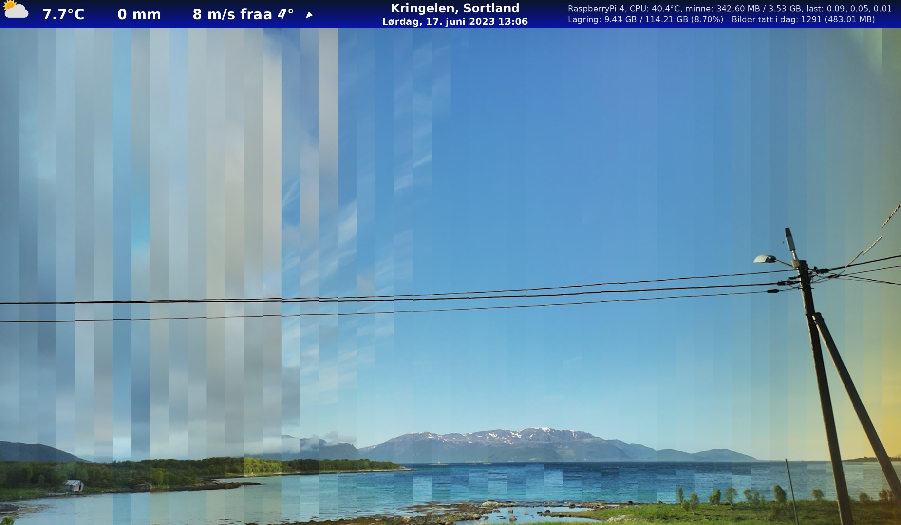

# Raspberry Pi Timelapse

Python3 scripts for capturing images using Raspberry Pi with [libcamera](https://libcamera.org/) and PiCamera v2 or v3.

Be sure to read the [Picamera2 manual](https://datasheets.raspberrypi.com/camera/picamera2-manual.pdf) and see [their github for indepth python usage](https://github.com/raspberrypi/picamera2).

Using the following python modules, see [requirements.txt](requirements.txt): 
> requests pyyaml argparse colorlog Pillow opencv-python colored picamera2 tqdm

## Config
Copy [example_config.yaml](example_config.yaml) to `config.yaml` and edit it to your specifications.

## Image capture

[capture_image.py](capture_image.py) takes the photo and put on the overlay made in [overlay.py](overlay.py)

    python capture_image.py

[timelapse.py](timelapse.py) will start the timelapse script that runs `capture_image.py` at the interval set in config.

    python timelapse.py
Can be set in crontab to start at boot:

    @reboot timelapse python /home/pi/raspberrypi-picamera-timelapse/timelapse.py

Or as a screen process:

    @reboot screen -dmS timelapse python /home/pi/raspberrypi-picamera-timelapse/timelapse.py

Then you could later resume the screen to see its progress:

    screen -r timelapse
## Create timelapse videos

Requires [ffmpeg](https://ffmpeg.org/) installed.

    sudo apt install ffmpeg

Run [create-timelapse.py](create-timelapse.py) to create a timelapse of yesterday's photos. It will call the [scripts/ffmpeg.py](scripts/ffmpeg.py) script, which is basically running this:

    ffmpeg_settings = [
        ('-y', None),  # Overwrite the output file without asking for confirmation
        ('-framerate', str(config['video_output']['framerate'])),
        ('-pattern_type', 'glob'),
        ('-i', f"{os.path.join(image_folder, '*.jpg')}"),
        ('-s', f"{config['video_output']['video_width']}x{config['video_output']['video_height']}"),
        ('-vf', f"deflicker,setpts=N/FRAME_RATE/TB"),
        ('-c:v', 'libx264'),
        ('-crf', str(config['video_output']['constant_rate_factor'])),
        ('-b:v', str(config['video_output']['bitrate']))
    ]

Specify a date to make timelapse of:

    python create-timelapse.py --date 2023-06-09

To create a test timelapse: 

    create-timelapse.py --date 2023-06-09 --dont-upload --debug

Will create `/var/www/html/public/video-debug/2023_06_09_1920_1160_23.mp4`

Can be set in crontab to automatically run at a specific time, for instance at midnight:

    @midnight python /home/pi/raspberrypi-picamera-timelapse/create-timelapse.py

Too see video specs:

    ffprobe -i /var/www/html/public/video-debug/2023_06_09_1920_1160_23.mp4

## Test scripts
### Day  slice

To create a day slice image with [scripts/daylineImage.py](scripts/daylineImage.py):

    python scripts/daylineImage.py 
        --folder /var/www/html/images/2023/06/17 
        --date 2023-06-17 
        --slices 24

It will create lines of day and put it from left to right as the final image.
`--slices` will define how many lines to put. Example photo has 48, so every line represent 30 minutes.

Will be created in `temp/dayline-2023-06-17.jpg`

### Test upload
To test upload a video:

    python scripts/upload-timelapse-video.py 
        --file /var/www/html/videos/2023/06/timelapse_2023_06_16.mp4 
        --date 2023-06-16
